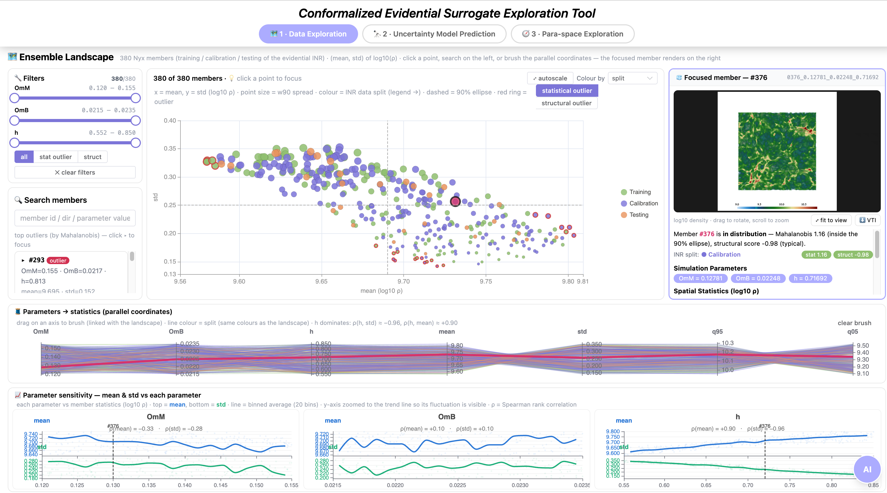
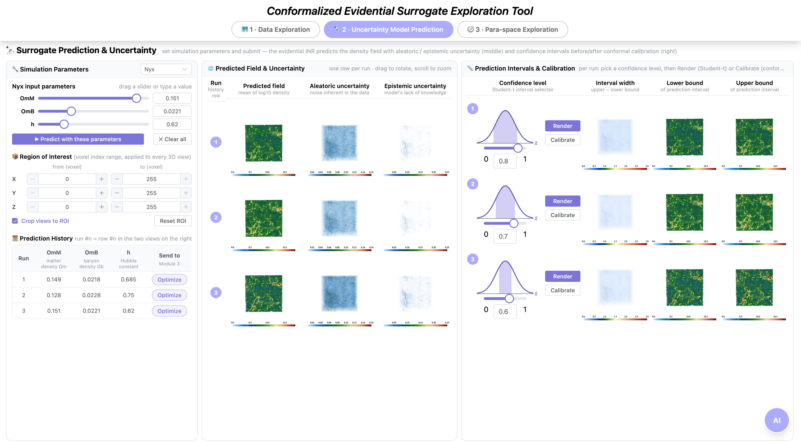
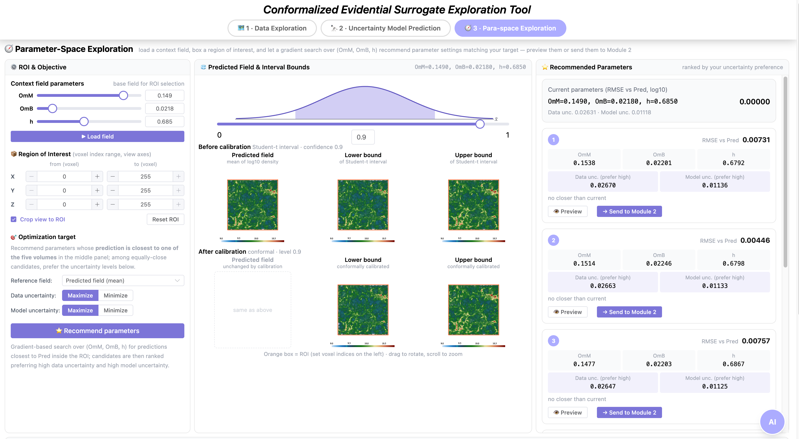

# CESET: An Interactive Visual Tool for Uncertainty-Aware Surrogate Exploration

**Yuhan Duan · Xin Zhao · Han-Wei Shen**
Department of Computer Science and Engineering, The Ohio State University

CESET (Conformalized Evidential Surrogate Exploration Tool) is an interactive web
tool for **uncertainty-aware exploration of simulation ensembles with neural
surrogates**. It wraps an evidential implicit neural representation (INR)
surrogate of a simulation ensemble and lets you explore the ensemble, predict
new fields with aleatoric/epistemic uncertainty and conformally calibrated
prediction intervals, and search the parameter space for settings that match a
region-of-interest target.

The reference deployment uses the **Nyx** cosmological ensemble
(parameters OmM, OmB, h; 256³ log-density fields), and the architecture is
dataset-agnostic — see [Using other datasets](#using-other-datasets).

The tool is organized as three linked modules, one per tab.

## Module 1 · 🗺 Data Exploration

Explore the raw ensemble before trusting the surrogate. The landscape scatter
places all 380 members by their (mean, std) of log10 density, colored by the
INR data split (training / calibration / testing) or by statistical clusters,
with outliers ring-marked. Filters, free-text search, and axis brushing on the
parallel coordinates all stay linked with the landscape; clicking any member
volume-renders it on the right with its parameters, outlier verdict, and
spatial statistics. The bottom panel shows how the ensemble mean and std
respond to each simulation parameter.


*Module 1: ensemble landscape (center) with linked filters and member search
(left), the focused member's volume rendering and statistics (right), parallel
coordinates linking parameters to statistics, and per-parameter sensitivity
curves (bottom).*

## Module 2 · 🔭 Uncertainty Model Prediction

Query the evidential INR surrogate at any parameter setting. Each submitted
run adds one aligned row to both views: the middle view renders the predicted
density field next to its aleatoric (data-inherent) and epistemic (model
knowledge) uncertainty volumes; the right view turns the same prediction into
a Student-t prediction interval at a chosen confidence level, and one click
conformally calibrates the interval bounds. A shared region of interest and a
synchronized camera apply to every 3D view.


*Module 2: parameter input and prediction history (left); per-run predicted
field with aleatoric / epistemic uncertainty (middle); per-run confidence-level
selector with interval width, lower, and upper bounds before or after conformal
calibration (right).*

## Module 3 · 🧭 Parameter-Space Exploration

Invert the surrogate: instead of asking "what does this parameter setting
produce," ask "which parameter settings produce this." Load a context field,
box a 3D region of interest, and pick an optimization target; a gradient-based
search over (OmM, OmB, h) then recommends the settings whose prediction best
matches the reference inside the ROI, ranked by your preference for high or
low data/model uncertainty. Each recommendation can be previewed in place or
sent back to Module 2 as a new run; surrogate-gradient sensitivity curves for
the current ROI render at the bottom of the page.


*Module 3: context field, ROI, and optimization target (left); predicted field
with Student-t and conformally calibrated interval bounds, ROI box overlaid
(middle); ranked parameter recommendations with per-candidate uncertainty and
one-click handoff to Module 2 (right).*

## Repository layout

```text
CESET/
├── backend/                 Flask API + evidential INR surrogate
│   ├── server.py            All endpoints (/generate, /calibration, /roi_optimize, …)
│   ├── inr_model.py         Evidential INR-FG architecture (NIG output head)
│   ├── model/               Pretrained Nyx evidential INR weights (58 MB, included)
│   ├── ai_agent.py          Optional RAG assistant (needs an LLM API key)
│   └── requirements.txt
├── frontend/                Vue 3 + Vite + Element Plus + vtk.js single-page app
├── ensemble_stats_430/      Precomputed ensemble statistics (JSON) + the scripts
│                            that computed them from the raw ensemble
├── start_demo.sh            One-shot local launcher (backend + frontend)
└── docs/                    Screenshots
```

## Requirements

- Linux or macOS (tested on Linux)
- **Python ≥ 3.9** with an **NVIDIA GPU + CUDA** — field generation runs the
  256³ INR forward pass on GPU (≈1–2 s on an A100). Without CUDA the server
  starts but logs an error and falls back to CPU, where a single field takes
  minutes — impractical for interactive use
- **Node.js ≥ 18** and npm

## Installation

```bash
git clone https://github.com/<your-username>/CESET.git
cd CESET

# 1) Backend Python environment (CUDA build of PyTorch, then the rest)
python -m venv .venv && source .venv/bin/activate
pip install torch==2.2.2 --index-url https://download.pytorch.org/whl/cu121
pip install -r backend/requirements.txt

# 2) Frontend
cd frontend && npm install && cd ..
```

## Running

```bash
./start_demo.sh          # starts backend (127.0.0.1:5001) + frontend (localhost:5173)
```

or run the two halves yourself:

```bash
cd backend  && python server.py     # Flask API on 127.0.0.1:5001
cd frontend && npm run dev          # Vite dev server on http://localhost:5173
```

Open <http://localhost:5173>. The Vite dev server proxies `/api/*` to the
backend. If the backend runs on another machine (e.g. a GPU node), either
tunnel port 5001 (`ssh -L 5001:127.0.0.1:5001 <gpu-node>`, recommended) or
start the backend with `BIND_HOST=0.0.0.0 python server.py` and the frontend
with `BACKEND_HOST=<gpu-node> npm run dev`.

**Smoke test** (verifies the GPU surrogate end to end):

```bash
curl -X POST http://localhost:5001/generate -H "Content-Type: application/json" \
     -d '{"dataname":"nyx","param":[0.149,0.0218,0.685],"datatype":1}'
# → {"code":0,"data":["p…_result.vti","p…_data_uncertainty.vti","p…_model_uncertainty.vti"]}
```

## What is included vs. optional data

Included in this repository — enough to run Modules 2 and 3 and the Module 1
landscape out of the box:

- pretrained Nyx evidential INR weights (`backend/model/`)
- precomputed ensemble statistics JSONs (`ensemble_stats_430/`, mirrored into
  `frontend/public/ensemble/`)

Optional data (large; enables the remaining features — contact the authors or
regenerate with the included scripts):

| Data | Enables | How to configure |
|---|---|---|
| Conformal calibration fields `<prefix>_calN_Qlo/Qhi_p<level>.bin` (per-voxel 256³ float32) | "After calibration" intervals (Module 2 Calibrate, Module 3 calibrated bounds) | `INR_CALIBRATION_DIR=<dir>` (default `<repo>/explorable-inr/outputs`) |
| Raw Nyx ensemble members (`<id>_<OmM>_<OmB>_<h>/Raw_plt256_00200/density.bin`) | Module 1 per-member volume rendering | `NYX_DATA_ROOT=<dir>` (default `<repo>/data/nyx/256/output`) |
| Voxel-wise ensemble statistics (`ensemble_stats_430/voxelwise/*.bin`) | `/ensemble/voxelwise` endpoint | regenerate with `ensemble_stats_430/compute_stats.py` |

Without them the UI degrades gracefully (the corresponding views report the
data as unavailable).

## Optional: AI assistant

The floating assistant answers questions about the current view state. Enable it
with either an environment variable (`ANTHROPIC_API_KEY` or `OPENAI_API_KEY`) or
a config file:

```bash
cp backend/ai_config.example.json backend/ai_config.json   # then fill in your key
```

Never commit `backend/ai_config.json` — it is gitignored. Without a key the
assistant falls back to retrieval-only answers.

## Using other datasets

CESET is built dataset-agnostic; the UI already carries parameter panels for
**Nyx**, **MPAS-Ocean**, and **CloverLeaf** (dataset selector in Module 2). To
plug in your own ensemble:

1. **Train an evidential INR surrogate** on your ensemble. The architecture is
   `backend/inr_model.py` (feature-grid INR, input = spatial coordinates +
   normalized simulation parameters, output = per-point NIG(γ, ν, α, β)); any
   training pipeline producing weights for this architecture works.
2. **Register the dataset in the backend** (`backend/server.py`): parameter
   ranges (`min_max_nyx_param`), value normalization range (`NYX_DMIN/DMAX`),
   grid resolution (`NYX_RES`), and the weights path (`INR_WEIGHTS`).
3. **Register the parameter panel in the frontend**
   (`frontend/src/components/ParameterView.vue`, `dataList` /`tableData`):
   parameter names, ranges, steps, and history-table column descriptions.
4. **Precompute ensemble statistics** for Module 1 with
   `ensemble_stats_430/compute_stats.py` over your raw ensemble, and point
   `frontend/public/ensemble/` at the resulting JSONs.
5. **(Optional) Precompute conformal calibration fields** — per-voxel Q_lo/Q_hi
   quantile corrections on a held-out calibration split at your confidence
   levels — and drop them in `INR_CALIBRATION_DIR` using the naming scheme
   above.

## Citation

CESET accompanies a short paper currently under review ("From Ensemble Context
to Calibrated Surrogate Steering"). A citation entry will be added upon
publication.

## License

[MIT](LICENSE)
